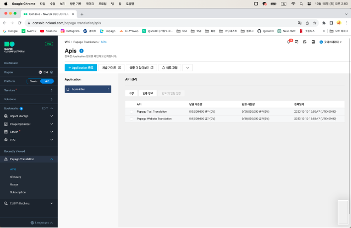
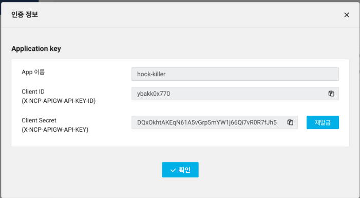
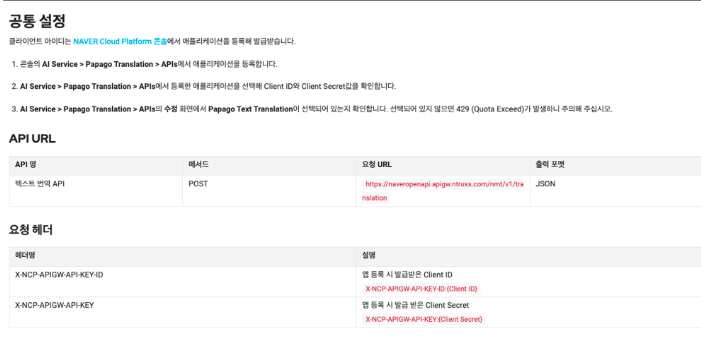
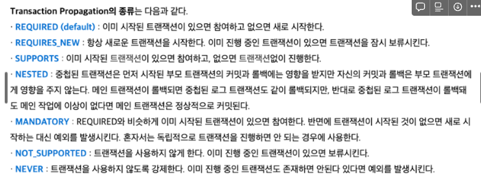

# Papago API

[Papago Text Translation 개요](https://api.ncloud-docs.com/docs/ko/ai-naver-papagonmt)

- app 이름 : hook-killer
- Client ID(X-NCP-APIGW-API-KEY-ID) : ybakk0x770
- Client Secret(X-NCP-APIGW-API-KEY) : DQxOkhtAKEqN61A5vGrp5mYW1j66Qi7vR0R7fJh5

- VM Option으로 주어질 변수
  - -Dpapago.X-NCP-APIGW-API-KEY-ID=ybakk0x770
  - -Dpapago.X-NCP-APIGW-API-KEY=DQxOkhtAKEqN61A5vGrp5mYW1j66Qi7vR0R7fJh5

---

## Papago Translation Issue 해결

https://github.com/hook-killer/back-end/issues/57

작업은 

`TranslationService`, `ArticleController`, `ArticleService`, `NoticeController`, `NoticeService` 에서 진행한다.

### TranslationService

실제로 파파고 API를 사용하여 통신하는 부분.

여기서 source, target에 따라 조건부 번역을 시도해야 할 듯 싶다. → 해보니까 아니었음!

### Article / Notice Controller

등록 / 수정이 일어나는 부분.

`@Transactional` 고려해야 할듯

여기에서 Service의 메소드를 호출하기 때문에..

흠 근데 컨트롤러에서 `@Transactional` 쓰는게 맞나?

### Article / Notice Service

`TranslationService`를 사용하여 실제로 게시글을 등록 / 수정하는 부분. → 여기서 CN, EN 번역 고려

create에서는 `@Transactional` 이 불필요하나,

update에서는 `@Transactional` 가 필요해보인다.

[Transaction Propagation and Isolation in Spring @Transactional](https://www.baeldung.com/spring-transactional-propagation-isolation)

`@Transactional(propagation = MANDATORY)`?

`@Transactional(propagation = REQUIRES_NEW)`?

Transactional은 `ArticleContent` 혹은 `NoticeContent` Entity 안의 update에 걸어주자.