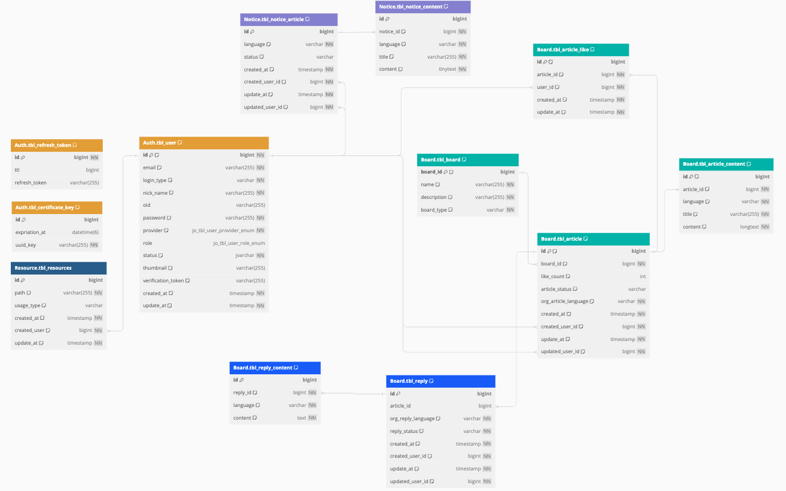

# README

> 프로젝트가 종료될 때 쯤엔 해당 Repository를 Public으로 공개할 예정입니다.

## Index

- [README](#readme)
  - [Index](#index)
  - [Member](#member)
  - [프로젝트 일정](#프로젝트-일정)
  - [아키텍쳐](#아키텍쳐)
  - [기술스택](#기술스택)
    - [FrontEnd](#frontend)
    - [BackEnd](#backend)
    - [Service](#service)
    - [DB](#db)
    - [CI/CD](#cicd)
    - [Tool](#tool)
  - [ERD](#erd)
  - [와이어프레임](#와이어프레임)
  - [회고](#회고)
    - [종원](#종원)
    - [세환](#세환)
    - [진석](#진석)
    - [근우](#근우)
    - [정훈](#정훈)
    - [재운](#재운)
  - [이슈 및 개발](#이슈-및-개발)
    - [종원](#종원-1)
    - [세환](#세환-1)
    - [진석](#진석-1)
    - [근우](#근우-1)
    - [정훈](#정훈-1)
    - [재운](#재운-1)
  - [Project Demo](#project-demo)
  - [부하테스트 기록 이미지](#부하테스트-기록-이미지)

## Member

<table>
 <tr>
    <td align="center"></td>
    <td align="center">
      
      </td>
    <td align="center"></td>
    <td align="center"></td>
    <td align="center"></td>
    <td align="center"></td>
  </tr>
  <tr>
    <td align="center"><a href="https://github.com/donsonioc2010"><b>종원</b></a></td>
    <td align="center"><a href="https://github.com/bongsh0112"><b>세환</b></a></td>
    <td align="center"><a href="https://github.com/wooni89"><b>재운</b></a></td>
    <td align="center"><a href="https://github.com/lljh1992"><b>정훈</b></a></td>
    <td align="center"><a href="https://github.com/kwchoi11"><b>근우</b></a></td>
    <td align="center"><a href="https://github.com/lgsok00"><b>진석</b></a></td>
  </tr>
</table>

## 프로젝트 일정

> [!NOTE]
> 23년 09월 27일 ~ 23년 10월 27일

## 아키텍쳐

> 위키 정리하고 위키 링크 걸어두기~

## 기술스택

<table>
 <tr>
    <th align="center"><h2>FrontEnd</h2></th>
    <td>
      
      
      
      
      
      
      
      
      
      
      
      
      
    </td>
  </tr>
  <tr>
    <th align="center"><h2>BackEnd</h2></th>
    <td>
      
      
      
      
      
      
      
      
    </td>
  </tr>
  <tr>
    <th align="center"><h2>Service</h2></th>
    <td>
      
      
      
      
      
      
      
      
      
      
      
    </td>
  </tr>
  <tr>
    <th align="center"><h2>Database</h2></th>
    <td>
      
    </td>
  </tr>
  <tr>
    <th align="center"><h2>CI / CD</h2></th>
    <td>
      
      
      
    </td>
  </tr>
  <tr>
    <th align="center"><h2>Tool</h2></th>
    <td>
      
      
      
      
      
      
    </td>
  </tr>
</table>

### FrontEnd

### BackEnd

### Service

### DB

### CI/CD

### Tool

## ERD

## 와이어프레임

> [!WARNING]  
> 많은 양의 이미지 이다보니 위키 링크를 첨부하였습니다.

- [와이어프레임 위키 링크](https://github.com/hook-killer/document/wiki/01.-WireFrame)

## 회고

> 각자 개발하면서 어떤 생각을 하는지 꾸준히 기록해보세요 😃

### 종원

### 세환

### 진석

### 근우

### 정훈

### 재운

## 이슈 및 개발

> 개발하면서 발생한 이슈 또는 개발관련 문제들에 대해서 기록하고 링크를 걸어보세요😃

### 종원

### 세환

### 진석

### 근우

### 정훈

### 재운

## Project Demo

> [!WARNING]  
> 많은 양의 이미지 이다보니 위키 링크를 첨부하였습니다.
> 양해 부탁드립니다.

- [프로젝트 데모 시연 위키 링크](https://github.com/hook-killer/document/wiki/Project-Demo)

## 부하테스트 기록 이미지

> 위키로 정리하고 위키 링크 기록하기
